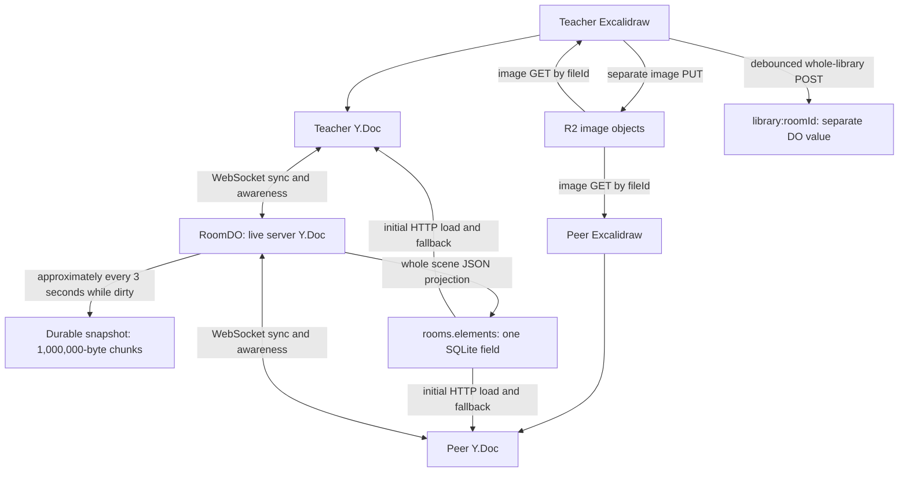

# Host–peer synchronization and large-content storage review

Reviewed 2026-09-05. Working assumption: teachers need both substantial saved whiteboards and a reusable teaching library. The user has reported repeated disconnects and sync problems. This pass investigates code and storage design; it does not repair or rerun tests, which another model owns.

The checkout changed during the review as other work landed. The latest observed HEAD was `5b30637`; the key RoomDO/Excalidraw paths below were re-read after those changes. Re-read the named functions before implementation. This document is a technical evidence appendix. **The only assignment/status queue is `PROJECT_IMPROVEMENT_TASKS.md`, including its focused sync/storage section. Do not dispatch work from this appendix.**

Revision after external review: incident diagnosis comes first; independently justified correctness fixes are separate slices. Unmeasured performance findings remain hypotheses about impact. Account libraries, lesson/page sharding and version history are deferred product options, not approved implementation requirements. No additional measurements or tests were run for this revision.

## Main conclusion

The project already has the right basic building blocks: a server-owned Yjs document, Durable Object persistence, and images stored separately in R2. However, **chunking the stored document does not make the complete system ready for arbitrarily large boards**. The HTTP projection, initial synchronization, repeated scene processing, image lifecycle, and library still have separate limits or reliability gaps.

There is no production room URL, close-code timeline, or live diagnostic sample attached to this review. The findings below identify concrete implementation gaps and plausible causes; they do not establish which caused a particular classroom incident. Historical test failures are not used as proof of a current production defect.

The first investigation is a matched teacher/peer disconnect timeline from the deployed build (SYNC-02). It gates attribution of the disconnects and prioritization of performance/protocol work. It does not block the independently evidenced saved-work wording, final-publish, stale-projection, image-availability or library-save correctness slices listed in the main queue. The remaining sections describe evidence and options, not a commitment to implement every finding.

## How data moves today

The arrows into clients from SQL are significant: HTTP results can be written back into the live Yjs document, rather than being used only as a temporary display cache.

### Current content locations and limits

| Data | Storage / load path | Current behavior relevant to a large teaching collection |
|---|---|---|
| Live drawing, text, geometry and image references | One Y.Doc per room in RoomDO and each connected browser | Every participant holds the room document; there is no page-based loading boundary. |
| Durable CRDT copy | `ydoc-meta:<room>` plus `ydoc-chunk:<room>:<index>` | Full document encoded and rewritten while dirty, at a nominal 3-second cadence. Chunk size is 1,000,000 bytes. |
| HTTP board copy | `rooms.elements` SQLite TEXT | Entire visible scene serialized into one row/field, even though the CRDT copy is chunked. |
| Image bytes | R2 `rooms/<room>/files/<fileId>` | App cap is 25 MiB per uploaded file. Browser asks for every missing referenced image, not just visible images. |
| Teacher shape library | `library:<room>` in the same room DO | Owner-only, whole-list replacement, capped at 256 KiB of JSON; belongs to the room, not the account. |
| Room metadata, roles, presence | RoomDO SQLite tables | Presence expires after 10 seconds. Hidden non-call tabs stop heartbeats. |
| Teacher identity and owned-room index | IdentityDO | Current application policy allows one owned room and host plus one student. These are product caps, not infrastructure capacity. |
| Offline browser copy | localStorage opt-in | Disabled by default. It is not a guaranteed backup of disconnected edits. |
| Recovery/history | DO operational restore procedures; browser undo; manual export | Browser undo is not durable lesson version history. DO restore does not by itself restore separately deleted R2 images. |

Sources in the repository: `RoomDO.ts` (`getRoomDoc`, `writeSnapshot`, `flushDirtyDocs`); `roomSchema.ts`; `roomLibrary.ts`; `boardFileRoutes.ts`; `plan/limits.ts`; `persistence.ts`; `SECURITY_BACKUP_RESTORE.md`.

Platform constraints checked against current primary documentation: SQLite strings/rows and individual KV entries have a 2 MB boundary; received WebSocket messages are limited to 32 MiB. Those are independent of the paid-plan per-object disk capacity. [Cloudflare Durable Object limits](https://developers.cloudflare.com/durable-objects/platform/limits/).

Bulk storage get/put/delete calls accept at most 128 keys/pairs. Storage APIs can also gate I/O during writes. [Cloudflare SQLite storage API](https://developers.cloudflare.com/durable-objects/api/sqlite-storage-api/).

The Worker isolate has 128 MB of memory, including live objects and temporary allocations; that is not 128 MB per board. [Cloudflare Worker limits](https://developers.cloudflare.com/workers/platform/limits/).

## What can look like a disconnect

| Symptom / evidence | Relevant path | Interpretation |
|---|---|---|
| Close `1008` | `RoomDO.webSocketMessage`, `signalingBudget.ts` | App abuse policy closed the connection. Normal budget 120 frames/sec/account; ceiling 360 with consecutive-window logic. It counts tabs sharing that account together. |
| Close `1009` | frame size check | Incoming frame exceeded the app cap, currently 32 MiB. A platform rejection may happen before the app can log it. |
| Close `4401` | stale grant/member check or periodic account authorization | Authorization changed, grant version stale, or account revoked. Do not remove these guards to reduce disconnect counts. |
| Close `4404` | room deletion | Terminal deletion; reconnecting the same deleted room is not recovery. |
| Upgrade refused before a socket opens | admission/session/connection cap | Up to 4 sockets per account per room and 32 per room. Browser WebSocket errors may not expose the HTTP reason to client code. |
| Provider reconnect with no server close code | installed `y-websocket` watchdog | Provider closes after about 30 seconds with no received messages and retries. This can reflect network loss, suspended browser activity or processing delays; it is not proof of a server policy close. |
| Peer/host vanishes from roster while WS stays open | presence expiry and visibility policy | Presence is maintained separately by HTTP. Hidden non-call tabs intentionally stop posting. A teacher switching to another resource can appear absent without leaving the board. |
| Canvas freezes but socket stays open | scene processing, caught observer/write errors, bootstrap race | This needs data-convergence and browser-main-thread evidence, not just a socket check. |
| Reload shows older or empty content | durability/projection/upload failure | “Saved” cannot be inferred from whether a peer briefly saw the edit. |

Existing useful events include `socket_close`, `frame_oversized`, `frame_shed`, `board_snapshot`, and internal operation errors. The current room stats report exposes numeric document size, SQL-row size, element/tombstone counts and point counts. It does not establish the last durable edit, queued upload status, or the reason for a specific past disconnect.

## Technical findings

The original P1/P2 labels below indicate potential impact, not measured incident priority. “Confirmed path” means source behavior is directly visible, not that the classroom symptom was reproduced. IDs are evidence references; the main queue defines actual slices and their test files. Keep existing TDD/verification rules when implementing later, and do not overlap the other model's test repairs.

### SYNC-01 — Report transport, document sync, and durable save separately (P1)

**Confirmed paths:** `useCollaboration.loadRoom` marks connected/synced even on HTTP errors; status handling treats a connected socket as synced. `ConnectionLostNotice.tsx` tells the user “Your work is saved in the room” and offers reload. There is no durable-save receipt backing that statement. `flushDirtyDocs` intentionally leaves recent work in memory between checkpoints and retries writes on failure.

**Consequence:** a teacher can be reassured at exactly the moment reload could discard local unsent work. A successful Yjs handshake is also not a durable-write acknowledgement.

**Independent bounded slice (SYNC-01a):** correct the unsupported saved-work wording now; this needs no incident attribution or new protocol. Example: “Connection lost. Recent changes may not be saved.” State redesign, export controls and local retention are separate decisions, not part of this wording correction.

**Design slice before protocol work:** orchestrator specifies a server-issued document generation/revision and durable watermark, including which pending image uploads are required for a complete save. Then a cheaper model can implement one receipt/status path. Do not equate a client timestamp or raw WebSocket send with a durable revision.

**Acceptance:** socket-open while initial sync is pending is shown truthfully; storage failure cannot show “saved”; reload is not presented as lossless while unsent work exists; successful recovery preserves edits and assets.

### SYNC-02 — Capture a disconnect timeline before changing limits (P1)

**Scope:** existing close logs, `roomStats`, provider status handling and a bounded diagnostic report. Report close code/reason/category, reconnect attempts/duration, last received message, true `provider.synced`, current document bytes, last successful snapshot/projection, save lag, pending uploads and browser queued bytes where available. Keep board content, names, tokens and image bytes out of the report.

Capture a teacher and peer timeline for the same room and deployed build. Distinguish server policy closes from browser-initiated watchdog reconnects and HTTP admission failures. Add a build identifier to diagnostics so a local change is not mistaken for a deployed fix.

**Acceptance:** a single incident can be classified as rate, frame size, auth, network/watchdog, save failure or unresolved without guessing. Avoid logging every pointer sample or computing a full encoded snapshot on every frame; stats should be requested or sampled.

**Investigation evidence, 2026-09-05:** GitHub Actions run `33935359842` successfully deployed commit `5b306379c29c3b46ca42ce10a13a26ef798f86eb`; its deployment log reports Worker version `4cb1f730-c0e6-4628-b1de-048a64c154f9`. A read-only `wrangler deployments list` independently confirms that version as the latest listed deployment at 100%, created `2026-09-05T01:16:21.811Z`. This establishes the checked deployment, not which build served an earlier incident.

**Existing capture surfaces:** owner-only `GET /api/whiteboard/room/<roomId>/stats` reports numeric document/row sizes and content counts. `logSocketClose` maps 1008 to `rate`, 1009 to `oversized`, and 4401 to `revoke`; its output is a categorized server event, not a complete browser disconnect timeline. Existing stats have no durable-save receipt. Missing values must be reported as unavailable, never inferred from connection status.

**Remaining evidence:** room URL and approximate incident time/timezone, followed by matched teacher/peer observations and relevant retained server events (if available). For a fresh reproduction, record transport close details, actual provider sync state, reconnect timing and a bounded before/after stats sample for that same room/build. Do not collect unrelated rooms or raw board content. No classroom incident has yet been captured or classified; SYNC-02 remains in progress, not shipped.

### SYNC-03 — Resolve the HTTP-seed versus live-document race (P1)

**Confirmed path / race to reproduce:** `loadRoom` queues SQL elements; a 250 ms drain calls `publishToSharedDoc` and writes them into the client Y.Doc. The provider is also independently starting its authoritative handshake. Initial SQL data is not version-merged against an already synchronized server scene in that drain. The HTTP row can lag the durable document, particularly after projection failure.

If seeding occurs before handshake, independent client/server Y.Map objects can be created for the same application element IDs. If it happens after a fresher update, stale field values can be written back. A JSON scene cache does not carry the same CRDT history as the server document.

**Design:** one authoritative bootstrap. Prefer server Yjs baseline for admitted clients; any HTTP preview must not automatically become a new local edit. Keep fallback only with explicit revision/reconciliation rules that preserve local unsent edits and authoritative deletions. Do not simply remove fallback before comparison evidence supports doing so.

**Scope:** `loadRoom`, `publishPending`, `publishToSharedDoc`, `mergeApiSnapshotElements`, provider initialization. **Acceptance:** delayed HTTP response versus delayed handshake cannot duplicate IDs, resurrect a clear, replace newer points, or discard disconnected work. Include sequential guest drawing followed by host drawing, not only simultaneous edits.

### SYNC-04 — Make handshake traffic terminate at the server (P2, before raising room capacity)

**Confirmed path:** every client requests resync every 3 seconds. RoomDO relays type-0 sync messages to other peers, then also processes them against its own document and issues its own replies. A peer can answer another peer's state-vector request through the same relay, creating avoidable response fan-out.

**Design:** distinguish sync step 1, step 2 and actual document updates. Server answers bootstrap/resync requests; accepted document changes are what other clients need. Preserve authorization, read-only sync and lossless convergence. Removing periodic resync is not the first step.

**Acceptance:** unchanged-room handshake traffic grows roughly linearly with clients instead of causing every peer to answer every other peer; late join/reconnect/clear remain correct. The current product cap is two occupants, so this is a scaling concern and potential extra traffic, not proof that fan-out caused today's two-person disconnects.

### SYNC-05 — Remove whole-board processing from each small change (P1)

**Confirmed paths:**

- `commitElements` deep-serializes the full scene; `publishScene` serializes it again. `serializeExcalidrawElement` is a JSON stringify/parse copy.
- `replaceSharedElements` rebuilds an index by traversing the entire Y.Array even for a one-element delta.
- `collaboration.ts` observes every element transaction, decodes the entire array and notifies React consumers. `useCollaboration.applyElements` compares complete JSON scenes and writes React/store state.
- ExcalidrawWrapper has a second observer for remote application. Its deferred React update does not eliminate the separate collaboration observer's immediate full-scene path.

**Consequence:** the work per short stroke increases with existing lesson size. The code's changed-element payload reduces wire bytes but does not remove all full-scene CPU/allocation work. No CPU duration or maximum safe element count was measured in this pass.

**Slices:** first eliminate redundant serialization; then bound React notifications; then maintain/invalidate a correct element index using real Yjs events. Preserve an occasional complete snapshot for export/UI as needed. Do not switch the CRDT schema or drop reconciliation in the same change.

**Acceptance:** a one-element edit avoids cloning/decoding every other element on each publish; receiving ink stays immediate; full exports, clearing, undo and remote ID handling remain correct. Measure short handwriting on a populated board in both teacher-to-peer and peer-to-teacher directions.

### SYNC-06 — Ensure the final stroke really publishes; preserve failed publishes (P1)

**Confirmed edge path:** pointer-up calls `commitElements(..., true)`, but `force` only bypasses `shouldPublish`. `elementsToPublish` still filters by changed version IDs. If the last points changed without a version bump, the forced candidate can be empty, so no Yjs write happens. This contradicts the reason for `force` documented in `scenePublish.ts`.

Additionally, `publishedVersionsRef` advances before the write, while `publishScene` catches a write exception. The baseline can therefore claim that a change was published when it was not.

**Scope:** candidate selection and baseline advancement only; preserve the existing 50 ms / 200 ms live-stroke cadence initially. **Acceptance:** the final geometry is sent even under the documented same-version edge case; a failed local Yjs write remains retryable; an ordinary remote echo does not republish the whole scene. Do not “fix” this by sending the entire board on every pointer-up.

### SYNC-07 — Make large reconnects possible and apply backpressure (P1 for large boards)

**Confirmed path:** storage chunks are rejoined into one Yjs snapshot. `serverSync.ts` writes a full missing-state reply into one encoder. The provider similarly sends its missing document state as one frame. There is no transfer manifest/chunk transport or application send-queue budget. Incoming app limit is already 32 MiB.

**Consequence:** a board that fits on disk can be too large to resend from an offline browser, or too expensive to hydrate at once. Repeating the same oversized state on reconnect does not make it smaller. Full snapshot/decoded document/JSON projection can coexist in memory.

**Design first:** bounded bootstrap transfer or smaller per-page documents, with resume/versioning and an explicit ready state. Do not split a binary Yjs message into arbitrary frames without a reassembly protocol. Do not raise the cap beyond the platform limit.

**Acceptance:** large known content opens/reconnects without a repeat oversized-frame loop; interrupted transfer resumes or restarts safely; local drawing stays recoverable; a slow consumer does not generate an unbounded queue. Queue awareness opportunistically, but never discard committed edits.

### SYNC-08 — Treat teacher presence as a lease, not tab visibility (P2)

**Confirmed behavior:** a hidden non-call tab stops heartbeats; `ACTIVE_WINDOW_MS` is 10 seconds and heartbeats back off to 5 seconds after completion. Network/processing time is additional to that delay. Returning to the tab refreshes presence, but it can already have disappeared from the roster. Empty `users` arrays are also ignored by `applyPresencePayload`, leaving stale roster state.

**Product decision:** a teacher looking at lesson material in another tab should normally remain in the lesson while the board connection is alive. Distinguish away/idle from disconnected and from revoked. Do not infer a membership grant from a heartbeat.

**Slices:** respect empty roster snapshots; define away state; choose a presence lease renewed by appropriate authenticated liveness with bounded expiry. **Acceptance:** switching tabs does not appear as being kicked, host identity stays stable, actual disconnect eventually expires, and revoked users stay out. Keep the R04 call-state work with its existing owner.

### STORE-01 — Remove the single-row scene projection limit (P1)

**Confirmed design conflict:** `flushDirtyDocs` writes `JSON.stringify(elements)` into `rooms.elements`; `DODatabase` uses real DO SQLite. The live CRDT is chunked, but this JSON field is not. Scene JSON can exceed the platform's row/string boundary. The catch retains a projection retry marker, leaving HTTP reads stale and retrying an operation that cannot succeed at that size.

**Minimal design:** keep room metadata in the room row, put the scene projection in bounded chunks or per-element rows with a generation manifest, and serve the published generation. Do not simply increase the HTTP request limit. The canonical Yjs copy and projection have different serialization sizes.

**Acceptance:** large valid board data beyond the old row boundary can be saved and reopened through the real HTTP path; smaller existing rooms migrate without data loss; interrupted projection never serves a mixture of generations. A failed projection does not freeze room freshness indefinitely.

**Secondary expiry note:** idle expiry reads `rooms.updated_at`, but pan/zoom persists viewport through the same room PATCH and refreshes that timestamp; settings changes also refresh it. Projection failure therefore exposes expiry only if these other writes also remain absent for 90 days and cleanup runs. This is a conditional, abandonment-like edge case, not the leading justification for STORE-01. Stale HTTP reads and permanently unsuccessful retries are the strong, directly evidenced limbs. Any later activity-lease change must still exclude rejected traffic and retain inactive-room expiry.

### STORE-02 — Keep checkpoints bounded and recover from incomplete state (P1/P2)

**Confirmed paths:** `writeSnapshot` sends metadata plus all chunks in one put; read passes every chunk key in one get; cleanup lists all chunk values and deletes them in one array. With 1,000,000-byte chunks the put exceeds the API pair count beyond 127 chunks. Memory and transport limits are likely to matter earlier. Full snapshot encoding/writing occurs repeatedly during drawing.

`readSnapshot` treats a missing chunk as no snapshot and falls back to the SQL seed, which may be stale. Also the durable snapshot and projection-retry marker are written across separate awaited operations: review crash ordering rather than assuming the marker always accompanies the checkpoint.

**Slices:** bounded batching under an atomic generation/manifest design; metadata-only cleanup or bounded listing; atomic checkpoint/projection-progress publication; explicit degraded recovery for missing/corrupt chunks. Keep the previous good generation until the replacement is complete. Do not silently overwrite damaged canonical storage with stale SQL seed data.

**Longer-term decision:** persist accepted update batches/journal entries and compact periodically rather than rewrite a very large document every three seconds. Bound journal growth and preserve CRDT identity; rebuilding a new Y.Doc under the same session without a generation protocol can resurrect old client state.

**Acceptance:** no bulk API call exceeds its key count; partial writes/restart recover a complete committed generation; live edits retain a truthful durable status. No performance or guaranteed recovery-window claim until measured under realistic load/failure.

### STORE-03 — Publish image availability, retry safely, and show upload state (P1)

**Confirmed race:** `handleElementsChange` starts image upload without awaiting it and continues publishing the scene/file reference. A receiver immediately calls `fetchMissingBoardFiles`; a 404 is inserted into `missingFileIdsRef` with no invalidation on upload success. A slow upload can thus become a permanently missing image for that mounted editor.

Upload failures unmark the file but only get another attempt on a later scene change. Closing/reloading before completion can lose the only local bytes. There is no “all images uploaded” save state. A bad data URL can also return without clearing the already-set upload marker.

**Minimal design:** retain nonblocking placeholders, distinguish pending/ready/failed assets, publish ready only after successful R2 write, and retry transient absence with a bounded policy. Do not restore a request-per-stroke 404 flood. Show pending uploads and let the teacher retry/export before leaving.

**Acceptance:** a peer sees an image after a delayed upload without reloading; failed upload is visible and retryable while idle; dangling references do not retry forever; the canvas remains responsive while uploading. A peer seeing an image reference does not by itself qualify the lesson as fully saved.

### STORE-04 — Bound browser image loading and decoded memory (P2)

**Confirmed path:** `fetchMissingBoardFiles` loops over the whole received scene and launches all missing fetches. Each response is buffered into bytes, converted into a base64 data URL, and retained by Excalidraw; library loading also fetches every referenced image. This is not viewport-lazy loading, despite the “lazy” comment referring to asynchronous fetching.

**Slices:** bounded request concurrency and foreground priority first; thumbnails for library browsing next; visible-page/viewport loading and safe release policy after the editor contract is understood. Preserve full-resolution assets in R2. Compression reduces transfer size but not the memory required to decode large images.

**Acceptance:** opening a lesson with many assets does not start an unbounded burst or block drawing; previews resolve first; exports fetch their required originals deliberately. Keep image/file references stable through undo and reuse.

### STORE-05 — Fix library-save reliability before enlarging it (P1)

**Confirmed paths:** current `MAX_LIBRARY_BYTES` is 256 KiB. `handleLibraryChange` ignores non-2xx responses, retries only on another edit, and discards a pending one-second debounce on unmount. The load effect sets `libraryLoadedRef=true` in `finally`, even after a failed load; a later edit can replace the stored library without having loaded it. Whole-list replacement also has no revision conflict check for two teacher tabs.

**Separate small slices:** show 413/5xx and retained pending edits; flush or explicitly preserve pending save on navigation; require successful load before whole-list replacement; add revision conflict protection. Do not increase the limit until the storage format supports it.

**Acceptance:** library additions are not silently lost on quick leave, failed load or two-tab editing; teacher can tell saved versus pending versus rejected; last-good server library remains recoverable.

## Deferred product options — do not implement now

The user's goal of retaining substantial content warrants considering these options, but it does not select their architecture. STORE-06/07/08 are excluded from the delivery queue until scale, retention and ownership decisions justify them. Existing-room reliability comes first; do not start lesson sharding for the current two-occupant product simply because this appendix describes it.

### STORE-06 — Teacher-owned content with per-item storage (deferred)

Today the library belongs to the room and is removed with room deletion/expiry. That does not match a large teaching collection used across lessons. The current one-room product cap encourages keeping everything on the same canvas, further increasing live-document cost.

**Recommended model:** account-owned library item metadata plus independently stored item payloads/assets; paginate search/listing and lazy-load selected items. Rooms/pages reference or intentionally copy selected content under an explicit ownership model. Do not load the whole library into the shared board or into one giant browser response.

**Decisions to make first:** account storage allowance, item limits, copy versus shared reference on insertion, retention and erasure ownership, handling deleted source items. Asset reference tracking must include both the lesson and the reusable library so one deletion does not break the other.

**Acceptance:** deleting a lesson does not delete unrelated reusable teacher content; a teacher opens their collection on another device; another account cannot enumerate or fetch it; a paginated collection can exceed the former whole-list limit without loading all payloads.

### STORE-07 — Saved lessons/pages separate from live sessions (deferred)

**Confirmed current model:** room board and room library share room lifecycle; idle room TTL is 90 days based on `updated_at`. There is no distinct pinned/persistent teaching document in this path, and library writes do not refresh the board timestamp. An automatic idle cleanup policy for classroom sessions is not an adequate retention promise for a teacher's long-term materials.

**Recommended direction:** a teacher-owned lesson holds metadata and pages; the live room/session grants access to a selected lesson/page. Each active page has a bounded synchronization document, while inactive pages/assets stay stored. Excalidraw frames in one document are organizational shapes, not a loading/sharding boundary.

**Incremental order:** decide saved-lesson retention; introduce saved lesson metadata; add ordered pages; load/sync only the selected page with stable IDs; then consider cross-page actions. Preserve old room URLs and migrate content explicitly. Do not change all authorization and CRDT boundaries in one cheaper-model assignment.

**Acceptance:** many saved lessons do not slow one open lesson; closing a class does not erase its owner's content; a selected page reloads with its assets; page changes and grants cannot expose private content or lose in-flight edits.

### STORE-08 — Recovery including images and library items (deferred)

The current operational DO restore guide is useful, but it is not a teacher-facing version history or a coordinated backup of R2. Orphan collection can remove an image that an older restored board would reference.

**Design:** bounded named/automatic lesson checkpoints with the referenced asset manifest and a matching retention policy. Store archival content outside the active Y.Doc. Decide recovery retention and storage allowance explicitly; do not promise unlimited history.

**Acceptance:** restore a previous lesson including images after edits/deletions; an expired checkpoint's assets can be reclaimed only when nothing retained references them; account erasure covers retained versions. Restoring an old grant or resurrecting revoked access is not part of content recovery.

## Assignment and status

Use only the focused sync/storage queue in `PROJECT_IMPROVEMENT_TASKS.md`. It names implementation/test scopes and separates diagnosis, correctness slices, measurement, and deferred decisions. This appendix has no independent completion status. Same-file slices must be serialized or developed in isolated worktrees; separate IDs are not permission for concurrent edits in this shared checkout.

## Capacity should be a measured product promise

Do not promise “10 GB whiteboards” from the disk allowance. Define independently: saved lesson count, pages per lesson, maximum active-page elements/points, total asset bytes, largest image dimensions, expected simultaneous peers/tabs, and offline edit duration. Then measure open time, received-ink latency, browser memory, server CPU, checkpoint lag and reconnect success at those boundaries.

Proposed evaluation ladder, not a claim of supported capacity: begin with the user's real problematic board, then increase active-page visible content and asset count separately. Include short handwriting on an already full board, sequential student-then-teacher drawing, long strokes, slow image upload, reconnect after offline edits, closing/reopening, and teacher tab switching. Preserve exact geometry and server authority. Disk capacity, browser rendering capacity and synchronization capacity are different numbers.

No runtime settings, application files, cloud resources or tests were changed by this investigation. This is a review/design handoff, not a production fix or a capacity certification.
